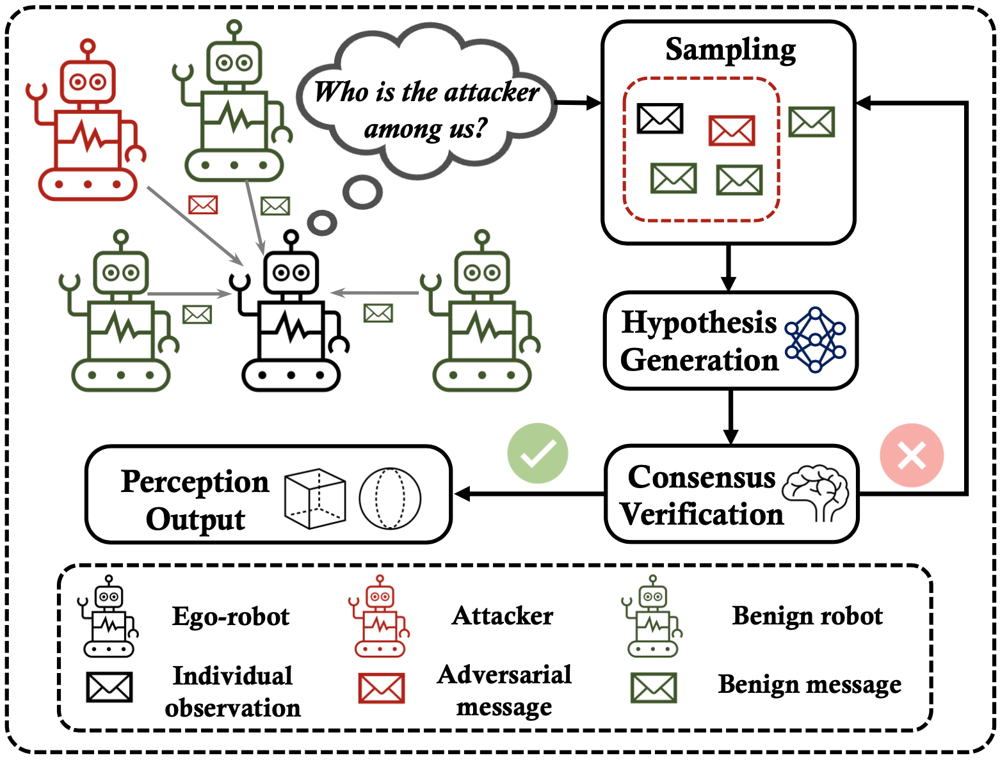

# *Among Us*: Adversarially Robust Collaborative Perception by Consensus

[Yiming Li*](https://scholar.google.com/citations?user=i_aajNoAAAAJ), [Qi Fang*](https://scholar.google.com/citations?user=LIuiQlkAAAAJ), [Jiamu Bai](https://github.com/jiamubai), [Siheng Chen](https://scholar.google.com/citations?user=W_Q33RMAAAAJ), [Felix Juefei-Xu](https://scholar.google.com/citations?user=dgN8vtwAAAAJ), [Chen Feng](https://scholar.google.com/citations?user=YeG8ZM0AAAAJ)

**"Simple yet effective sampling mechanism against malicious attackers in multi-agent collaborative perception settings"**

<p align="center"> </p>

[**ArXiv: Among Us: Adversarially Robust Collaborative Perception by Consensus**](https://arxiv.org/abs/2303.09495)        

## Abstract

Multiple robots could perceive a scene (e.g., detect objects) collaboratively better than individuals, although easily suffer from adversarial attacks when using deep learning. This could be addressed by the adversarial defense, but its training requires the often-unknown attacking mechanism.

Differently, we propose **ROBOSAC**, a novel sampling-based defense strategy generalizable to unseen attackers. Our key idea is that collaborative perception should lead to consensus rather than dissensus in results compared to individual perception. This leads to our hypothesize-and-verify framework: perception results with and without collaboration from a random subset of teammates are compared until reaching a consensus. 

In such a framework, more teammates in the sampled subset often entail better perception performance but require longer sampling time to reject potential attackers. Thus, we derive how many sampling trials are needed to ensure the desired size of an attacker-free subset, or equivalently, the maximum size of such a subset that we can successfully sample within a given number of trials. We validate our method on the task of collaborative 3D object detection in autonomous driving scenarios.


## Getting Started
- [Installation](docs/Installation.md/#installation)
- [Dataset Preparation](docs/Installation.md/#dataset-preparation)
- [Specifying Dataset and Model Checkpoint](docs/Installation.md/#specifying-dataset)


## Run ROBOSAC

in the directory of `AmongUs`:

```bash
cd coperception/tools/det/
```

```bash
python robosac.py [-d DATA] [--log] [--logpath LOGPATH] [--visualization]
                         [--pert_alpha PERT_ALPHA] [--adv_method ADV_METHOD]
                         [--eps EPS] [--unadv_pert_alpha UNADV_PERT_ALPHA]
                         [--scene_id SCENE_ID] [--sample_id SAMPLE_ID]
                         [--iteration_per_sample ITERATION_PER_SAMPLE]
                         [--robosac ROBOSAC] [--ego_agent EGO_AGENT]
                         [--robosac_k ROBOSAC_K] [--ego_loss_only]
                         [--step_budget STEP_BUDGET]
                         [--box_matching_thresh BOX_MATCHING_THRESH]
                         [--adv_iter ADV_ITER]
                         [--number_of_attackers NUMBER_OF_ATTACKERS]
                         [--fix_attackers] [--use_history_frame]
                         [--partial_upperbound]
```

**NOTE: Due to some data syncing issues, ROBOSAC cannot be performed under multi-GPU environment.** 

**You may need to specify CUDA_VISIBLE_DEVICES in front of python commands if you are using multiple GPUs:**

```bash
CUDA_VISIBLE_DEVICES=0 python robosac.py [your params]
```


#### Overview of params in ROBOSAC

```python
-d DATA, --data DATA  
	The path to the preprocessed sparse BEV training data, test set.
	(default: *Specify your dataset location here*)

# Adversarial perturbation
--adv_method ADV_METHOD
	pgd/bim/cw-l2 
	(default: pgd)

--eps EPS             	
	epsilon of adv attack. 
	(default: 0.5)

--adv_iter ADV_ITER   
	adv iterations of computing perturbation 
	(default: 15)

    
# Scene and frame settings    
--scene_id SCENE_ID   
	target evaluation scene 
	(default: [8]) 
    	#Scene 8, 96, 97 has 6 agents. This param could not be specify in commandline, you shall change its default value, e.g. [96]

--sample_id SAMPLE_ID
	target evaluation sample 
	(default: None)

    
# ROBOSAC modes and parameters
--amongus ROBOSAC    
	upperbound/lowerbound/no_defense/robosac_validation/robosac_mAP/
  	adaptive/fix_attackers/performance_eval/probing 
    	(default: )

--ego_agent EGO_AGENT
	id of ego agent (default: 1)(agent 0 is RSU/Road Side Unit)

--robosac_k ROBOSAC_K   
	specify consensus set size if needed (default: None)

--ego_loss_only       
	only use ego loss to compute adv perturbation(default: False)

--step_budget STEP_BUDGET
	sampling budget in a single frame (default: 3)

--box_matching_thresh BOX_MATCHING_THRESH
	IoU threshold for validating two detection results
	(default: 0.3)

--number_of_attackers NUMBER_OF_ATTACKERS
	number of malicious attackers in the scene 
	(default:1)

--fix_attackers       
	if true, attackers will not change in different frames
	(default: False)

--use_history_frame   
	use history frame for computing the consensus, reduce 1 step of forward prop. 
	(default: False)

--partial_upperbound  
	use with specifying robosac_k, to perform clean collaboration with a subset of teammates 
	(default: False)
```

## Experiment
- [Validation of ROBOSAC Algorithm (Success Rate)](docs/Experiment.md/#validation-of-robosac-algorithm-success-rate)
- [Evaluation of Detection Performance (mAP)](docs/Experiment.md/#evaluation-of-detection-performance-map)
- [Attacker Ratio Estimation (Aggressive-to-conservative Probing, A2CP)](docs/Experiment.md/#attacker-ratio-estimation-aggressive-to-conservative-probing-a2cp)


## Acknowledgment  

*Among Us* is modified from [coperception](https://github.com/coperception/coperception) library.

PGD/BIM/CW attacks are implemented from [adversarial-attacks-pytorch](https://github.com/Harry24k/adversarial-attacks-pytorch) library.

This project is not possible without these great codebases.


## Citation

If you find this project useful in your research, please cite:

```
@article{li2023amongus,
      title={Among Us: Adversarially Robust Collaborative Perception by Consensus}, 
      author={Li, Yiming and Fang, Qi and Bai, Jiamu and Chen, Siheng and Juefei-Xu, Felix and Feng, Chen},
      journal={arXiv preprint arXiv:2303.09495},
      year={2023}
}
```
